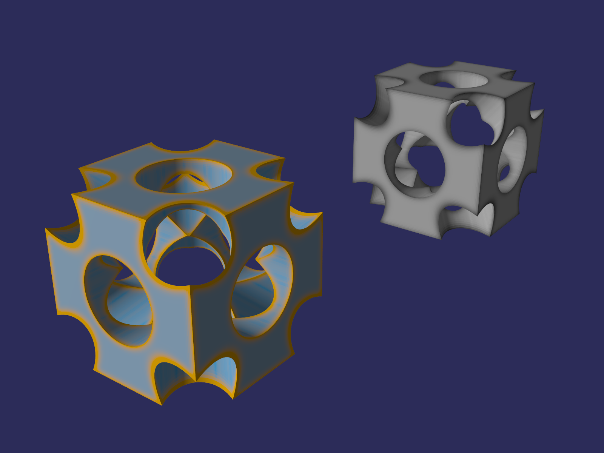
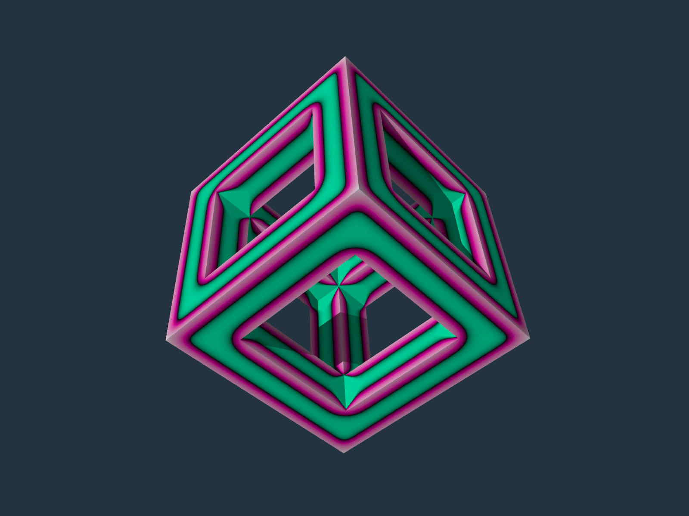
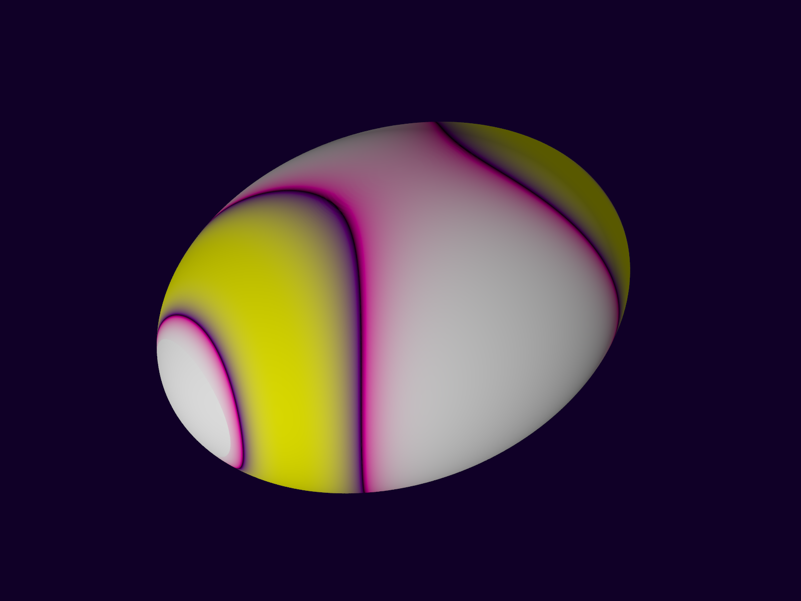
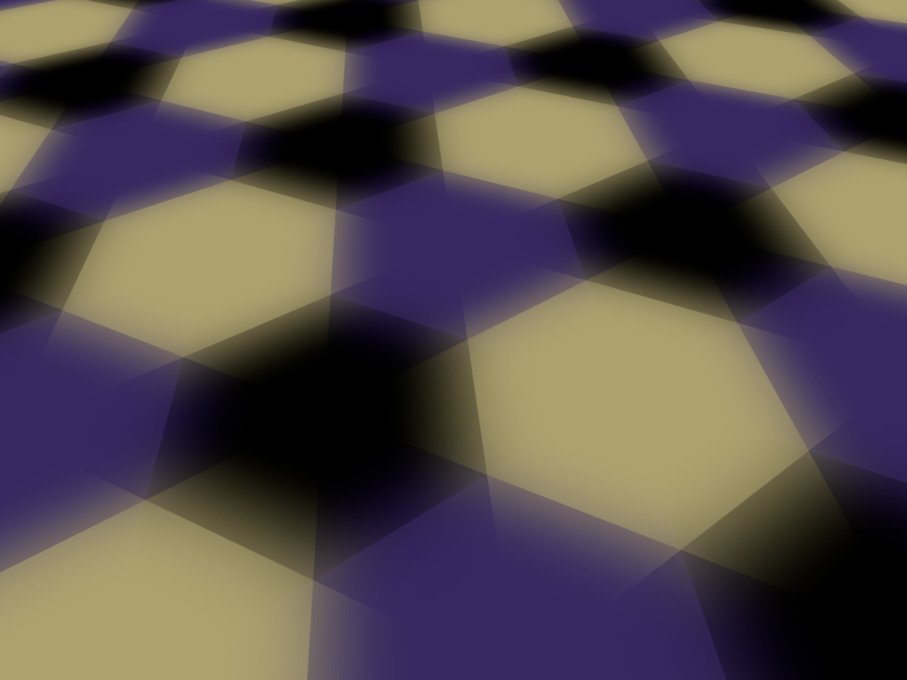
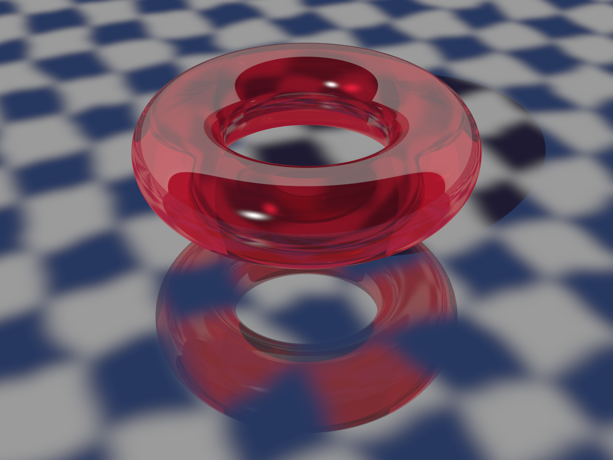
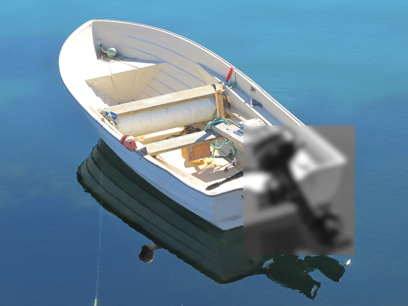
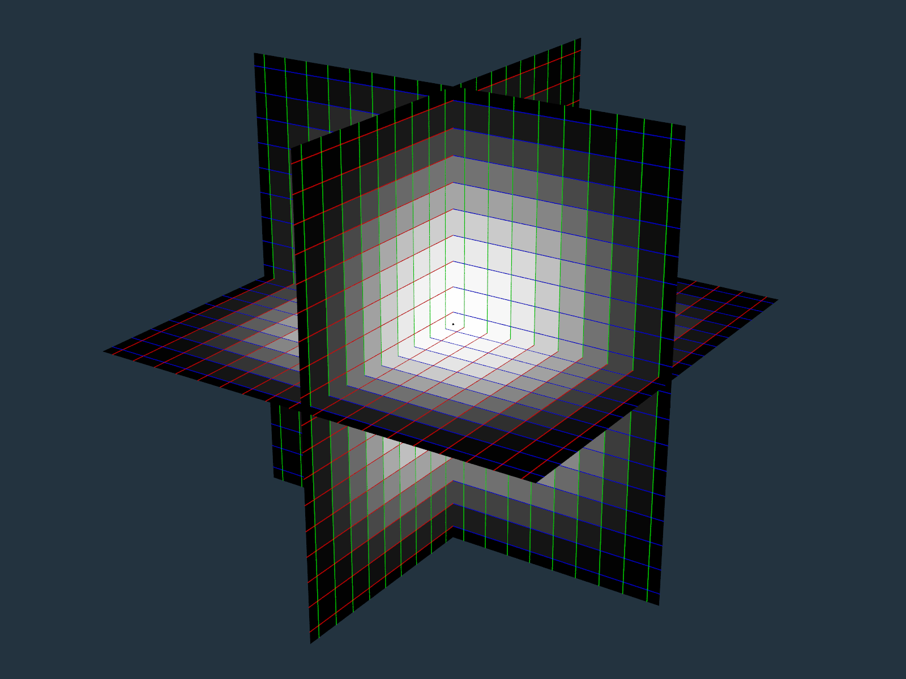

# POV-Ray-gaussian-blur
[POV-Ray](http://www.povray.org) v3.7 include file for blurring pigments and functions in one, two or three dimensions.

## Images created with some of the examples:

### Blur object pigment for CSG
[Source code](Examples/Blur_Object_Pigment_For_CSG.pov)\

### Blur object pigment for mesh2
[Source code](Examples/Blur_Object_Pigment_For_mesh2.pov)\

### Blur object pigment from other object
[Source code](Examples/Blur_Object_Pigment_From_Other_Object.pov)\

### Blur hexagon pigment
[Source code](Examples/Blur_Hexagon_Pigment.pov)\

### Blur checker texture
[Source code](Examples/Blur_Checker_Texture.pov)\

### Blur image region
[Source code](Examples/Blur_Image_Region.pov)\

### Verify blur XYZ
[Source code](Examples/Verify_Blur_XYZ.pov)\

### Project homepage

https://github.com/t-o-k/POV-Ray-gaussian-blur/

### Author

[Tor Olav Kristensen](http://subcube.com)
