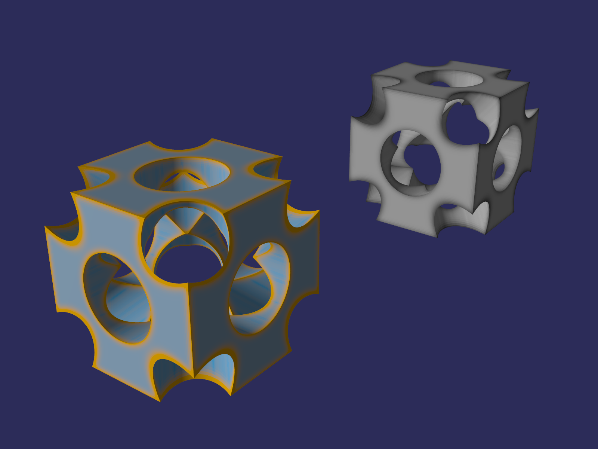
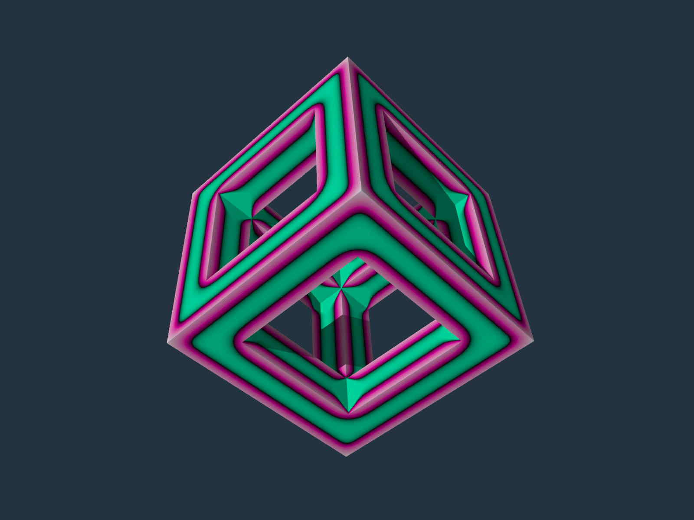
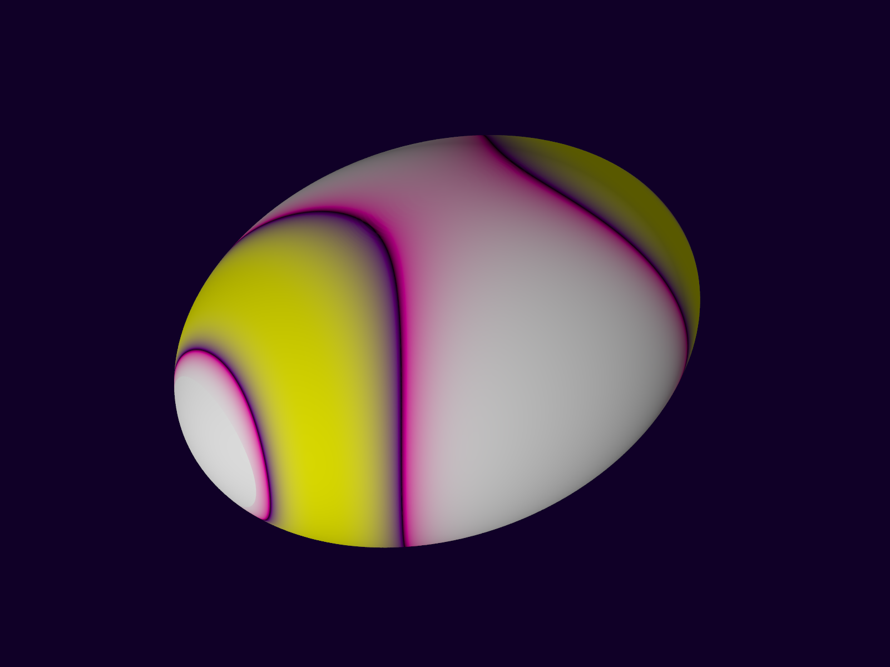
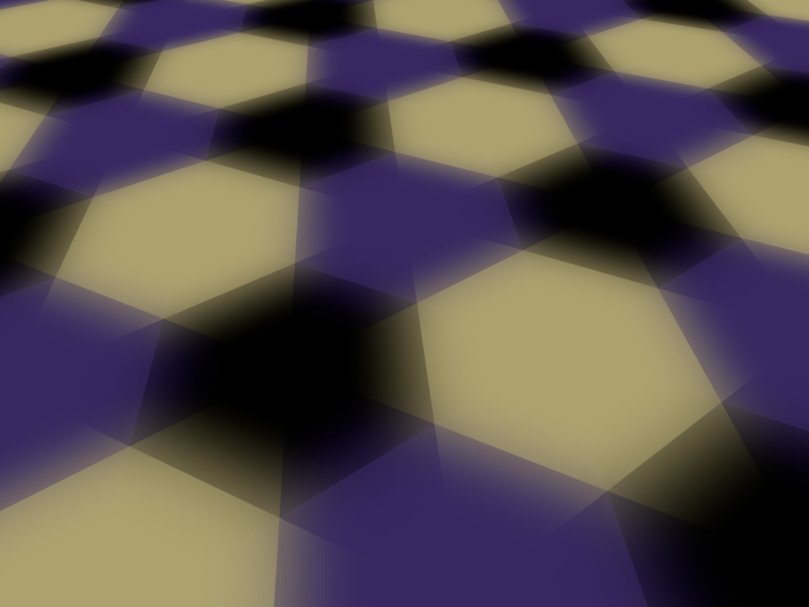
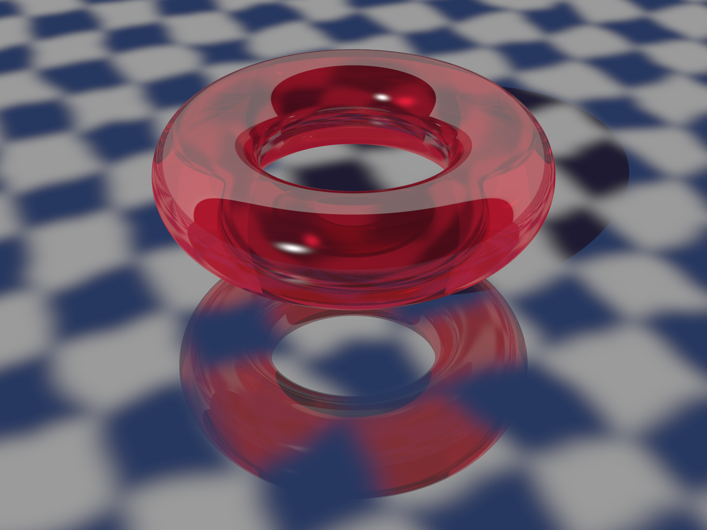
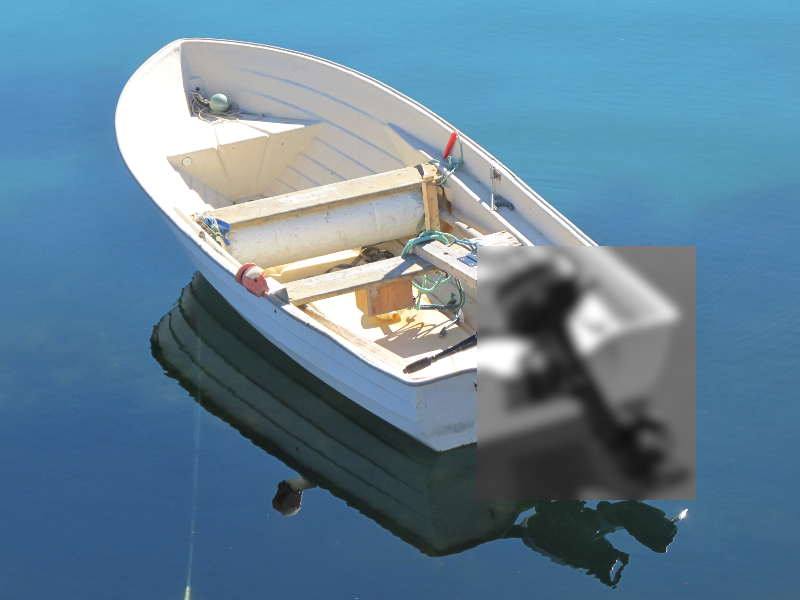
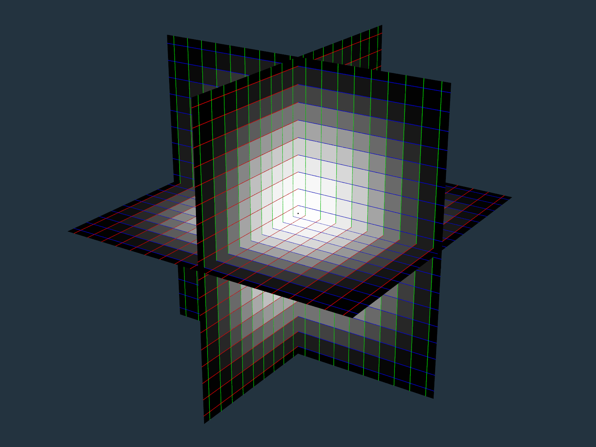

# POV-Ray-gaussian-blur
POV-Ray v3.7 include file for blurring pigments and functions in one, two or three dimensions.

## Images created with some of the examples:

### Blur object pigment for CSG
[Code](Blur_Object_Pigment_For_CSG.pov)\

### Blur object pigment for mesh2
[Code](Blur_Object_Pigment_For_mesh2.pov)\

### Blur object pigment from other object
[Code](Blur_Object_Pigment_From_Other_Object.pov)\

### Blur hexagon pigment
[Code](Blur_Hexagon_Pigment.pov)\

### Blur checker texture
[Code](Blur_Checker_Texture.pov)\

### Blur image region
[Code](Blur_Image_Region.pov)\

### Verify blur XYZ
[Code](Verify_Blur_XYZ.pov)\

